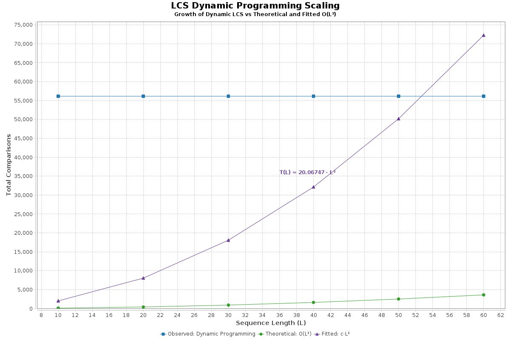

# DNASubsequenceLCS

## 1. Overview

**DNASubsequenceLCS** is a Java-based implementation of the **Longest Common Subsequence (LCS)** problem, developed as part of **Lab 3** for the *Algorithms for Bioinformatics* course. Two algorithmic strategies have been incorporated:

- A **Dynamic Programming** method providing efficient polynomial-time computation
- A **Brute Force Enumeration** method used as a reference baseline

The system accepts an input file containing multiple labeled DNA sequences and performs all pairwise LCS comparisons. For each comparison, the longest common subsequence is computed using both methods, with the following features supported:

- Output of the LCS string, its length, and detailed resource usage (comparisons, execution time, memory)
- Optional rendering of the full dynamic programming matrix for traceability
- Generation of summary tables and aggregate statistics for all pairwise comparisons
- Execution of **scaling benchmarks** over increasing sequence lengths and sequence pair counts
- Curve fitting and visualization of empirical performance against theoretical complexity:
    - $( T(L) = c \cdot L^2 )$ for dynamic programming
    - $( T(L) = c \cdot 2^L )$ for brute-force enumeration

Three plots are produced automatically during benchmarking, illustrating asymptotic growth:

<div align="center">
  
  
  
</div>

---

### 1.1 Java Version
#### Versioning

This project adheres to **semantic versioning** for version management. The current development version is:

- **Version**: 1.0-SNAPSHOT

#### Development Environment

The implementation, testing, and execution of this project were carried out in the following environment:

- **Operating System**: Ubuntu (via WSL2 on Windows)
- **Java Version**: OpenJDK 17
- **Build Tool**: Maven 3.8.1
- **IDE**: IntelliJ IDEA Ultimate

---

### 1.2 Project Structure

```
DNASubsequenceLCS/
├── input/                          # Benchmark and test case input files
│   ├── required_input.txt         # Core required 4-sequence example
│   ├── biological_cases.txt       # Synthetic biological patterns (SNPs, indels, repeats)
│   ├── edge_cases.txt             # Degenerate and malformed sequences
│   ├── scaling_input.txt          # All L-scaling + N-scaling batch input
│   ├── Lscaling_lengthXX_pairs5.txt   # L-scaling benchmark input files
│   ├── Nscaling_length30_pairsXX.txt # N-scaling benchmark input files
│   └── DynamicLab2Input.txt       # Instructor-provided validation set

├── output/                        # Benchmark results, plots, and logs
│   ├── *_results.txt              # Pairwise LCS output files
│   ├── scaling_benchmark.txt      # Comparison counts for L-scaling
│   ├── nsequences_benchmark.txt   # Comparison counts for N-scaling
│   ├── scaling_plot_*.png         # Dynamic and brute-force scaling plots
│   └── nsequences_plot.png        # N-sequence scaling plot

├── logs/                          # Full run logs for diagnostics
│   ├── full_run.log
│   └── run_all.log

├── src/main/java/jhu/edu/algos/
│   ├── Main.java                  # Top-level dispatcher
│   ├── LCSDriver.java             # Executes all pairwise LCS comparisons
│   ├── benchmark/                 # Benchmark automation
│   │   ├── LScalingBenchmark.java
│   │   └── NSequencesBenchmark.java
│   ├── graph/                     # Plot generation using JFreeChart
│   │   ├── LScalingGraphGenerator.java
│   │   └── NSequencesGraphGenerator.java
│   ├── io/                        # Input and output formatting
│   │   ├── SequenceInputHandler.java
│   │   └── OutputFormatter.java
│   ├── lcs/                       # Core LCS algorithms and data classes
│   │   ├── AbstractLCS.java
│   │   ├── LCSBruteForce.java
│   │   ├── LCSDynamic.java
│   │   └── LCSResult.java
│   └── utils/                     # Utilities for metrics and input generation
│       ├── PerformanceMetrics.java
│       ├── CurveFitter.java
│       └── InputGenerator.java

├── src/test/java/jhu/edu/algos/  # JUnit test suite
│   ├── LCSDriverTest.java
│   ├── benchmark/...
│   ├── io/...
│   ├── lcs/...
│   └── utils/...

├── run_all.sh                    # Full automation script for all comparisons and benchmarks
├── pom.xml                       # Maven build specification
├── Book_AJ_Lab3.jar              # Final compiled jar (target/)
└── README.md                     # Project documentation
```

---

## 2. How to Compile and Run

### 2.1 Compile with Maven

To compile the project, Maven should be used to build all source classes and package the application:

```bash
mvn clean package
```

This will:
- Clean the project directory
- Compile all Java source files
- Run all unit tests
- Produce a runnable `.jar` in the `target/` directory:

```
target/Book_AJ_Lab3.jar
```

---

### 2.2 Run with Maven (Recommended for Development)

During development, the program may be run directly using Maven without building or referencing the `.jar` file manually. The command below runs the default pairwise LCS comparison:

```bash
mvn exec:java \
  -Dexec.mainClass="jhu.edu.algos.Main" \
  -Dexec.args="input/required_input.txt output/required_input_results.txt"
```

To include matrix output, the `--matrix` flag may be appended:

```bash
mvn exec:java \
  -Dexec.mainClass="jhu.edu.algos.Main" \
  -Dexec.args="input/required_input.txt output/required_input_results.txt --matrix"
```

This approach is ideal for iterative testing and debugging.

---

### 2.3 Run from Packaged JAR

The program may also be executed directly from the compiled `.jar` file using the `java` CLI:

```bash
java -cp target/Book_AJ_Lab3.jar jhu.edu.algos.Main \
  input/required_input.txt \
  output/required_input_results.txt
```

With matrix visualization enabled:

```bash
java -cp target/Book_AJ_Lab3.jar jhu.edu.algos.Main \
  input/required_input.txt \
  output/required_input_results.txt \
  --matrix
```

This will:
- Load and validate sequences from the specified input file
- Perform all $\binom{n}{2}$ pairwise comparisons
- Output the results to the target output file
- Optionally print an LCS length matrix (symmetric, dynamic-only)

---

### 2.4 Run Full Benchmark Suite

To execute both benchmark modes (L-scaling and N-sequence), generate all performance plots, and log all output to file, the provided batch script can be used:

```bash
bash run_all.sh
```

This script performs the following:
- Compares all test files in the `input/` directory
- Runs both benchmark modes
- Writes output `.txt` results and `.png` plots to the `output/` directory
- Logs all command-line activity to `logs/full_run.log`

The benchmark suite will automatically generate:
- `scaling_benchmark_length_plot_dynamic.png`
- `scaling_benchmark_length_plot_bruteforce.png`
- `nsequences_benchmark_n_plot.png`

as well as:
- `scaling_benchmark.txt`
- `nsequences_benchmark.txt`

---

## 3. Features

The system has been designed to support robust and comparative analysis of the **Longest Common Subsequence (LCS)** problem. It provides a dual-algorithm framework, customizable execution modes, automated benchmarking, and visualization-ready output formatting.

---

### 3.1 Supported LCS Algorithms

Two LCS algorithms are implemented in this system:

- **Dynamic Programming**  
  A classical bottom-up approach with time complexity  
  $$T_{\text{DP}}(L_1, L_2) = O(L_1 \cdot L_2)$$
  where $( L_1 )$ and $( L_2 )$ are the lengths of the input sequences. This method guarantees optimal performance and is used for all scaling benchmarks and comparisons.

- **Brute Force Enumeration**  
  An exhaustive search of all common subsequences. Time complexity is exponential in the worst case:  
  $$T_{\text{BF}}(L) = O(2^{L_1 + L_2})$$
  This method serves as a conceptual baseline for measuring asymptotic divergence and is automatically disabled beyond a threshold of 25 characters per sequence.

---

### 3.2 Configurable Execution Modes

The system supports two primary execution workflows:

- **Pairwise Comparison Mode**  
  Users may specify a `.txt` file of labeled DNA sequences. All pairwise comparisons are computed using both algorithms (where feasible), with full metrics and matrix visualization optionally enabled.

- **Benchmarking Mode**  
  Synthetic inputs are generated using a controlled design:
  - **L-scaling**: increasing sequence lengths, fixed number of comparisons
  - **N-scaling**: fixed sequence lengths, increasing number of sequence pairs  
    These inputs are processed in batch to analyze empirical growth curves for both algorithms.

All pairwise evaluations are computed over $\binom{n}{2}$ unique sequence pairs.

---

### 3.3 Command-Line Execution Interface

The system may be executed via Maven or directly from the `.jar` file. The following modes are supported:

| Mode       | Description                                                        |
|------------|--------------------------------------------------------------------|
| **compare**   | Runs all $\binom{n}{2}$ pairwise comparisons on a sequence set |
| **benchmark** | Triggers the full benchmark suite (with optional plotting)         |

Optional flags:
- `--matrix` to include the full LCS dynamic programming table in output
- `--plot` to auto-generate `.png` plots after benchmark execution

---

### 3.4 Performance Metrics Captured

During each pairwise comparison, the following metrics are recorded for both algorithms:

- Total number of character comparisons
- Total time elapsed in milliseconds
- Estimated space usage in megabytes
- LCS string and length

Aggregated summaries are appended at the end of every output file for both the dynamic and brute force methods.

---

### 3.5 Output Formatting and Reporting

All output files follow a structured, human-readable format and include the following:

- Echoed input sequences with identifiers and lengths
- One block per pairwise comparison including:
  - LCS string and length
  - Performance metrics for each algorithm
  - Full DP matrix (if `--matrix` is enabled)
- Summary table listing comparison counts, runtime, memory usage, and LCS length
- Aggregate totals for all comparisons

A symmetric LCS-length matrix (only for Dynamic Programming) may also be printed to console for visual inspection of comparative similarity across all pairs.

---

## 4. Supported LCS Algorithms

This project implements two contrasting algorithmic strategies for computing the **Longest Common Subsequence (LCS)** between DNA sequence pairs:

| Algorithm         | Time Complexity      | Space Complexity    | Strategy Description                                  |
|------------------|----------------------|---------------------|------------------------------------------------------|
| Dynamic Programming | $\mathcal{O}(mn)$  | $\mathcal{O}(mn)$ | Classical 2D matrix-based method for LCS computation |
| Brute Force       | $\mathcal{O}(2^n)$ | Varies              | Exhaustive enumeration of all subsequence candidates |

Each pair of sequences is compared **exactly once** using both algorithms (unless brute force is skipped due to length constraints). The number of total comparisons is derived using the binomial formula:

$$\text{Number of Comparisons} = \binom{n}{2}$$

where n is the number of input sequences.

---

### All-vs-All Pairwise Evaluation

The system automatically executes all pairwise comparisons across sequences provided in the input file. For example:

- Given 4 sequences, the system evaluates $\binom{4}{2} = 6$ unique pairwise combinations.
- For each pair, both algorithms are executed (unless brute force is disabled or capped), and their outputs are written to the designated output file.

This approach enables comparative benchmarking across multiple input types, supporting both biological test cases and synthetic benchmarks for algorithmic scaling.

---

## 5. Input/Output Format

### 5.1 Input Format

The input file must contain **DNA sequences labeled by unique identifiers**, each on a separate line in the format:

```
S1 = ACCGGTCGACTGCGCGGAAGCCGGCCGAA
S2 = GTCGTTCGGAATGCCGTTGCTCTGTAAA
S3 = ATTGCATTGCATGGGCGCGATGCATTTGGTTAATTCCTCG
S4 = CTTGCTTAAATGTGCA
```

Each line must:
- Begin with a unique identifier (e.g., `S1`, `S2`, etc.)
- Use an equals sign (`=`) as the delimiter
- Contain a valid nucleotide sequence composed of A, C, G, and T (case-insensitive)

#### Input Validation and Error Handling

| Error Type            | Behavior                                                                 |
|-----------------------|--------------------------------------------------------------------------|
| Fewer than 2 sequences| Execution terminates with a clear exception message                      |
| Missing delimiter     | Skipped with a logged warning                                            |
| Duplicate IDs         | Skipped; only the first occurrence is retained                           |
| Empty sequences       | Allowed; a warning is issued, and trivial LCS is computed                |
| Invalid characters    | Non-ACGT characters are removed with a warning during preprocessing      |

---

### 5.2 Output Format

The output file summarizes the LCS results across all **pairwise comparisons** $\binom{n}{2}$ of the input sequences. The layout includes the following sections:

---

#### 1. **Header: Echoed Input Sequences**

The file begins by echoing all input sequences with their respective labels and lengths for traceability:

```
======================================================================
Number of sequences to be compared: 4
Sequence #1 | Length: 29
ACCGGTCGACTGCGCGGAAGCCGGCCGAA
...
======================================================================
```

---

#### 2. **Per-Pair LCS Comparison Block**

For each unique pair (e.g., `S1 vs S2`), both the dynamic programming and brute-force methods are evaluated. Each comparison includes:

- Pair label and LCS length
- Full LCS string (if applicable)
- Optional dynamic programming matrix
- Runtime and memory footprint of both algorithms

Example:
```
Comparing sequences S1 vs S2
Longest common subsequence | Length: 20
GTCGTCGGAAGCCGGCCGAA
```

---

#### 3. **Subsequence Matrix (Optional)**

If the `--matrix` flag is enabled, a **visualization of the LCS dynamic programming matrix** is printed below each pairwise block. This matrix provides a clear trace of the DP table fill-in process, showing how characters are aligned to compute the LCS.

```
Printing out subsequence matrix...
	  G T C G T T C G G A A T G C C G T T G C T C T G T A A A
0   0 0 0 0 0 0 0 0 0 0 0 0 0 0 0 0 0 0 0 0 0 0 0 0 0 0 0 0
A   0 0 0 0 0 0 0 0 0 0 1 1 1 1 1 1 1 1 1 1 1 1 1 1 1 1 1 1
...
```

This matrix is especially useful for:
- Debugging
- Verifying correctness of alignment
- Understanding LCS computation step-by-step

---

#### 4. **LCS Performance Blocks (Dynamic vs Brute Force)**

Each comparison ends with two algorithm-specific blocks:

```
-- Dynamic Programming LCS --
LCS        : GTCGTCGGAAGCCGGCCGAA
Length     : 20
Comparisons: 4,875
Time (ms)  : 0.0000e+00
Space (MB) : 2.6588e-03

-- Brute Force LCS --
LCS        : -
Length     : 1
Comparisons: 0
Time (ms)  : 0.0000e+00
Space (MB) : 0.0000e+00
```

If brute force is disabled (e.g., due to exceeding the sequence length cap), a placeholder dash (`-`) is used, and metrics are reported as zero.

---

#### 5. **Summary Table**

After all pairwise results are listed, a concise summary is printed:

```
Summary Table (Comparisons, Time, and Space)
======================================================================
Pair             | Dyn_Comp     Dyn_Time     Dyn_MB       | BF_Comp      BF_Time      BF_MB        | LCS_Len
----------------------------------------------------------------------
S1 vs S2         |      4,875   0.0000e+00   2.6588e-03 |          0   0.0000e+00   0.0000e+00 | 20
S1 vs S3         |      4,875   0.0000e+00   2.6588e-03 |          0   0.0000e+00   0.0000e+00 | 19
...
======================================================================
```

This table facilitates quick visual comparison of algorithmic performance across pairs.

---

#### 6. **Aggregate Performance Summary**

At the end of the file, a system-wide summary of resource usage is appended:

```
===== Aggregate Performance Summary =====
Dynamic Programming: Total Time = 0 ms | Total Space = 0.020 MB
Brute Force        : Total Time = 0 ms | Total Space = 0.000 MB
==========================================
```

---

## 6. Testing

### 6.1 Unit and Integration Testing

The system has been rigorously tested using **JUnit 5**, with unit and integration tests written to validate core components of the LCS pipeline. Tests are located under `src/test/java/`, organized by functional domain (e.g., `lcs`, `io`, `utils`, `benchmark`).

Each test class ensures correctness of:

| Component               | Coverage                                                                 |
|------------------------|--------------------------------------------------------------------------|
| `LCSDynamic`            | Verifies dynamic programming computes correct LCS strings and lengths   |
| `LCSBruteForce`         | Ensures enumeration of all subsequence combinations (limited length)    |
| `LCSDriver`             | Integration test validating input parsing, pairwise logic, and formatting |
| `OutputFormatter`       | Confirms file and console output structure, including matrix output      |
| `SequenceInputHandler`  | Ensures parsing and validation of labeled DNA sequences                  |
| `PerformanceMetrics`    | Validates correct tracking of comparisons, time, and space               |
| `CurveFitter`           | Tests model fitting for both power law and exponential curve estimation |
| `Benchmark Modules`     | Ensures correct file generation and input scaling for all benchmark modes |

Each comparison is carefully tested with synthetic inputs and verified against expected LCS results.

---

### 6.2 Execution and Validation Strategy

Each major function of the program is exercised in isolation and in aggregate:

- **Correctness testing**: Known test cases (e.g., `S1 = ACGT`, `S2 = AGT`) are used to validate dynamic and brute force output.
- **Edge case testing**: Blank sequences, invalid labels, mixed case, and biological edge patterns are tested explicitly.
- **Exception handling**: Invalid inputs (e.g., malformed lines, duplicate IDs) trigger clear and recoverable errors.

Example test method:

```java
@Test
void testFailsWithSingleSequence() throws Exception {
  Files.write(Path.of("temp.txt"), List.of("S1 = ACTG"));
  Exception ex = assertThrows(IllegalArgumentException.class,
    () -> LCSDriver.runFromFile("temp.txt", "output.txt", false));
  assertTrue(ex.getMessage().contains("At least two sequences"));
}
```

---

### 6.3 Matrix Visualization Testing

To validate correct DP matrix visualization, the following were tested:

- **Symmetry of LCS length matrix**
- **Correct dimension (m+1) x (n+1) matrix output**
- **Correct header and character alignment**
- **Matrix rendering for longer sequences (≥ 30 bp)**

The `--matrix` flag was tested in all primary workflows to ensure robust visualization rendering.

---

### 6.4 Test Coverage

The test suite covers the following dimensions:

| Test Category     | Coverage Examples                                       |
|-------------------|---------------------------------------------------------|
| Input Validation   | Missing sequences, duplicate labels, GC-bias cases      |
| Algorithm Logic    | LCS correctness for varying length pairs (dynamic vs brute) |
| Output Formatting  | Console + file output with and without matrix rendering |
| Benchmarks         | L-Scaling, N-Scaling performance generation             |
| Curve Fitting      | Verification of \( cL^2 \) and \( c2^L \) models        |
| Exception Handling | Invalid files, insufficient sequences, bad formatting   |

---

### 6.5 Running Tests

To execute the full test suite, use:

```bash
mvn test
```

All results are printed to the console and recorded in `target/surefire-reports/`.

---


## 7. Enhancements

The **DNASubsequenceLCS** system incorporates multiple enhancements beyond a basic implementation of the Longest Common Subsequence algorithm. These improvements address usability, performance evaluation, visualization, and extensibility.

---

### 7.1 Brute Force Execution Capping

Brute force execution is conditionally skipped when sequence length exceeds a configurable threshold (default: 25 characters). This enhancement avoids exponential blow-up and ensures smooth runtime even during batch evaluations.

- Capping logic prevents system hang or memory exhaustion.
- Output explicitly marks skipped comparisons with `"null"` or `"--"` to preserve result alignment.
- This dynamic skip also supports plotting by leaving missing values in scaling graphs.

---

### 7.2 Asymptotic Benchmarking with Curve Fitting

To empirically verify asymptotic behavior of each algorithm, two benchmark modes are included:

- **L-Scaling**: Varies sequence length L, holds pair count constant.
- **N-Scaling**: Varies number of sequence pairs $\binom{n}{2}$, holds L fixed.

Each benchmark reports total comparisons, time, space, and generates output plots:
- $\text{Dynamic: } T(L) \sim cL^2$
- $\text{Brute Force: } T(L) \sim c2^L$

The coefficient c is estimated via least squares regression using log-transformed fitting. This allows for comparative slope visualization of theoretical vs observed growth.


---

### 7.3 Matrix Rendering and LCS Visualization

A user-friendly visual rendering of the dynamic programming matrix can be optionally displayed via the `--matrix` flag. This renders:

- Row/column nucleotide headers
- Intermediate LCS length computations
- Final LCS value trace

In addition to the final LCS string and length, this matrix supports debugging and teaching use cases by demonstrating internal state construction.

---

### 7.4 Input Generator with Biological Edge Case Design

The project includes an extensible **InputGenerator** capable of generating:

- **Synthetic DNA sequences** for scaling benchmarks
- **Biologically inspired cases** such as:
  - Palindromes
  - Reverse complements
  - GC-bias vs AT-bias
  - Indels and SNPs
  - Tandem repeats

These inputs were designed to simulate realistic genomic motifs and provide stress tests for the algorithms. Generated files are written to `input/` and automatically picked up by the benchmarking scripts.

---

### 7.5 Modular CLI Dispatch and Auto-Batching

The `Main.java` dispatcher intelligently routes to:
- `LCSDriver` for standard comparisons
- `LScalingBenchmark` or `NSequencesBenchmark` for performance analysis

This modular CLI system simplifies reproducibility and supports batch runs over any `input/*.txt` files. Logs are saved under `logs/`, and all results are written to `output/`.

---

### 7.6 Robust Logging and Output Formatting

All comparisons output the following in a consistent, structured format:
- Input sequence echo (with labels and lengths)
- Pairwise LCS length and string
- Optional matrix rendering
- Performance metrics:
  - Comparison count
  - Elapsed time (ms)
  - Estimated space (MB)
- Summary table
- Aggregate summary totals

Console and file output are synchronized via a unified `OutputFormatter`, which enables analysis, graphing, and grading consistency.

---

### 7.7 Cross-Platform and IDE-Independent Execution

The project can be executed either:
- Directly via compiled JAR
- Using `mvn exec:java` for immediate IDE-integration
- Or via `run_all.sh` for full pipeline automation

---

---
## 8. Author
- **Project**: Book_AJ_Lab3_LCS
- **Course**: Algorithms for Bioinformatics  
- **Institution**: Johns Hopkins University
- **Author**: AJ Book
- **Lab**: 3 – Longest Common Subsequence Algorithms
---
